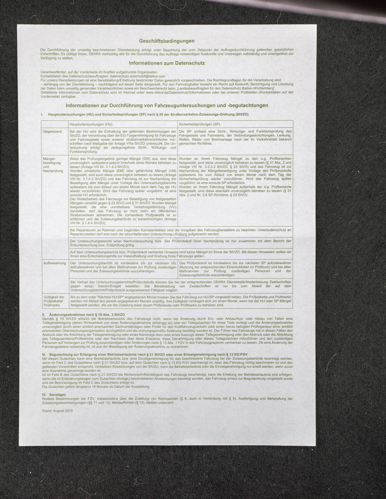
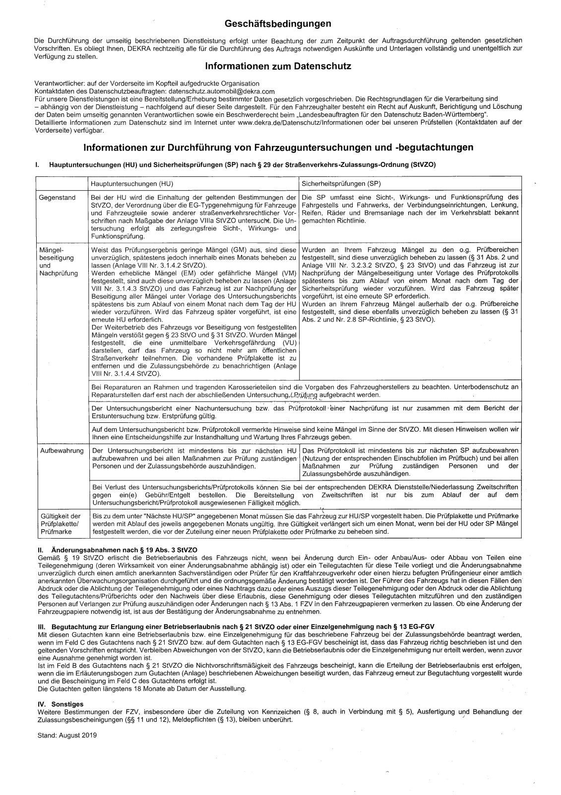

## Photo2SearchablePDF

Prototype for a dynamic archival-system to get rid of paper.

### What it already can do

- correct perspective by detecting corners -> transform to preset paper-size
- crop to page, with additional crop-parameter to get rid of page-edges
- convert to black & white with dynamic threshold-parameter
- detect text and produce a pdf with searchable invisible text overlay
- recompress pdf and correct paper-size
- input images with 10 MiB get compressed to ~ 200 - 600 kiB PDFs, still containing the image data
- detect date, language and custom keywords

### Preconditions

- photos of documents on dark background
- installed ghostscript for improved pdf compression
- installed tesseract for OCR

### Howto

- currently, only command line without interface
- configure
    - main language
    - input folder and folders for temp-data and final results
    - paper format
    - access to tesseract and ghostscript installation (if installed correctly command "gs" and "tesseract" should be enough)

### planned features for the future

- improve keyword-detection
- merge several pages together
- auto-rename for archive, something like: date_company_subject
- multicore, processing is currently singlecore and takes ~ 9 s per image
- improve page-detection (edge-detection)

## Example

### Input (resized)



### Corrected perspective, cropped and enhanced text (resized)



### Text from OCR in PDF (first quarter)

```
Geschäftsbedingungen

Die Durchführung der umseitig beschriebenen Dienstleistung erfolgt unter Beachtung der zum Zeitpunkt der Auftragsdurchführung geltenden gesetzlichen
Vorschriften. Es obliegt Ihnen, DEKRA rechtzeitig alle für die Durchführung des Auftrags notwendigen Auskünfte und Unterlagen vollständig und unentgeltlich zur

Verfügung zu stellen.

Informationen zum Datenschutz

Verantwortlicher: auf der Vorderseite im Kopfteil aufgedruckte Organisation

Kontaktdaten des Datenschutzbeauftragten: datenschutz.automobil@dekra.com
Für unsere Dienstleistungen ist eine Bereitstellung/Erhebung bestimmter Daten gesetzlich vorgeschrieben. Die Rechtsgrundlagen für die Verarbeitung sind
- abhängig von der Dienstleistung — nachfolgend auf dieser Seite dargestellt. Für den Fahrzeughalter besteht ein Recht auf Auskunft, Berichtigung und Löschung
der Daten beim umseitig genannten Verantwortlichen sowie ein Beschwerderecht beim „Landesbeauftragten für den Datenschutz Baden-Württemberg‘.
Detaillierte Informationen zum Datenschutz sind im Internet unter www.dekra.de/Datenschutz/Informationen oder bei unseren Prüfstellen (Kontaktdaten auf der
Vorderseite) verfügbar.

Informationen zur Durchführung von Fahrzeuguntersuchungen und -begutachtungen

I. Hauptuntersuchungen (HU) und Sicherheitsprüfungen (SP) nach 8 29 der Straßenverkehrs-Zulassungs-Ordnung (StVZO)

Hauptuntersuchungen (HU) Sicherheitsprüfungen (SP)

Gegenstand Bei der HU wird die Einhaltung der geltenden Bestimmungen der | Die SP umfasst eine Sicht-, Wirkungs- und Funktionsprüfung des
StVZO, der Verordnung über die EG-Typgenehmigung für Fahrzeuge | Fahrgestells und Fahrwerks, der Verbindungseinrichtungen, Lenkung,
und Fahrzeugteile sowie anderer straßenverkehrsrechtlicher Vor- | Reifen, Räder und Bremsanlage nach der im Verkehrsblatt bekannt
schriften nach Maßgabe der Anlage VIlla StVZO untersucht. Die Un- | gemachten Richtlinie.
tersuchung erfolgt als zerlegungsfreie Sicht-, Wirkungs- und
Funktionsprüfung.
```
